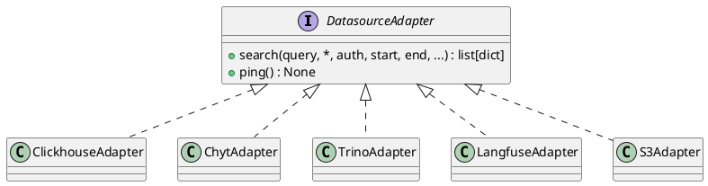

# Feature: Multi-backend Search (Adapter Pattern)

## One-liner
Unified search API over 5 heterogeneous LLM trace backends via a single `DatasourceAdapter` protocol.

## Problem
Each backend (S3/DuckDB, ClickHouse, Trino, Langfuse, CHYT) has a completely different query model. Routes needed a single dispatch point that doesn't change when backends are added.

## Implementation
- `src/dataimporter/adapters.py` — `DatasourceAdapter` Protocol with `search()` and `ping()`.
- `get_adapter(ds: Datasource) -> DatasourceAdapter` factory; one `_REGISTRY` entry per backend type.
- Concrete adapters: `ClickhouseAdapter`, `ChytAdapter`, `TrinoAdapter`, `LangfuseAdapter`, `S3Adapter`.
- `GET /api/public/logs/search` — accepts `q`, `start`, `end`, `session_id`, `trace_id`, `trace_type`, `input_hash`, `limit`, `time_field`, `filters`, `datasource`.

## Scope
- **In**: All 5 backend adapters; unified search params; `get_adapter()` factory; `GET /ready` and `GET /health` use `ping()`.
- **Out**: Write operations; cross-datasource federated search.

## Known gaps
- S3 schema discovery and proxy search bypass `get_adapter()` — handled as explicit S3 branches in their routes.
- `time_field` param is passed through but only ClickHouse/Trino respect it; other adapters use hardcoded column names.
