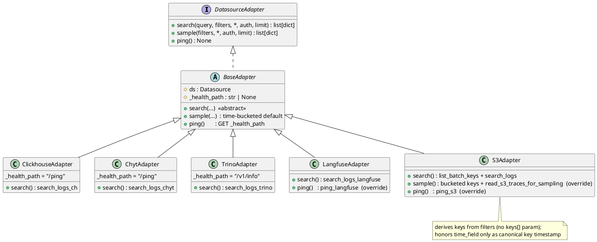

# Phase 1 Data Model: Datasource Adapter Redesign

## SearchFilters (value object)

The request-scoped filter context shared by `search()` and `sample()`. Built once per request and
passed immutably down the call chain, replacing the repeated 7-parameter filter list.

```python
from __future__ import annotations

from dataclasses import dataclass
from datetime import datetime


@dataclass(frozen=True)
class SearchFilters:
    """Bundled, tz-normalized filter context for search() and sample().

    Built once per request by get_search_filters(); all datetimes are
    normalized to UTC at construction so adapters/backends never re-normalize.
    """
    start: datetime | None = None
    end: datetime | None = None
    session_id: str | None = None
    trace_id: str | None = None
    trace_type: str | None = None
    input_hash: str | None = None
    time_field: str | None = None  # None → backend's documented default column
```

### FastAPI dependency

```python
# routes/deps.py
from datetime import datetime, timezone
from fastapi import Query


def _utc(dt: datetime | None) -> datetime | None:
    if dt and dt.tzinfo is None:
        return dt.replace(tzinfo=timezone.utc)
    return dt


def get_search_filters(
    start: datetime | None = Query(default=None),
    end: datetime | None = Query(default=None),
    session_id: str | None = Query(default=None),
    trace_id: str | None = Query(default=None),
    trace_type: str | None = Query(default=None),
    input_hash: str | None = Query(default=None),
    time_field: str | None = Query(default=None),
) -> SearchFilters:
    return SearchFilters(
        start=_utc(start), end=_utc(end),
        session_id=session_id, trace_id=trace_id,
        trace_type=trace_type, input_hash=input_hash,
        time_field=time_field,
    )
```

Individual `Query()` params are kept so FastAPI still documents the query string in the OpenAPI
schema; the dependency assembles them into one object.

## Adapter protocol + base class

```python
from typing import Protocol, runtime_checkable


@runtime_checkable
class DatasourceAdapter(Protocol):
    async def search(self, query: str, filters: SearchFilters, *, auth: AuthContext, limit: int = 50) -> list[dict]: ...
    async def sample(self, filters: SearchFilters, *, auth: AuthContext, limit: int = 5) -> list[dict]: ...
    async def ping(self) -> None: ...


class BaseAdapter:
    """Shared adapter behavior. Concrete adapters override search(); ping()/sample() are inherited."""
    _health_path: str | None = None  # set by HTTP-GET-health backends (CH, CHYT, Trino)

    def __init__(self, ds: Datasource) -> None:
        self.ds = ds

    async def search(self, query, filters, *, auth, limit=50) -> list[dict]:
        raise NotImplementedError

    async def sample(self, filters, *, auth, limit=5) -> list[dict]:
        """Time-bucketed representative sample (see research.md Decision 4)."""
        ...  # split [start,end] into `limit` windows, search(limit=1) each, merge+dedupe

    async def ping(self) -> None:
        if self._health_path is None:
            raise NotImplementedError
        import httpx
        async with httpx.AsyncClient(timeout=3) as client:
            resp = await client.get(f"{self.ds.url.rstrip('/')}{self._health_path}")
            resp.raise_for_status()
```

### Class diagram



## Schema-discovery output (unchanged)

The field map contract is preserved exactly as today:

```python
# SampleResponse shape (route returns a plain dict matching this)
# {
#   "fields": { "<dot.path>": { "type": str, "example": Any }, ... },
#   "sample_count": int
# }
```

- `type` ∈ {`bool`, `int`, `float`, `list`, `object`, `string`} (via `_infer_type`)
- Nested dicts flattened with dot-joined keys to depth 3 (`_collect_fields`)
- Keys with a leading `_` excluded
- Object fields carry `example: None`; list examples truncated to first 2 elements

## time_field resolution rules

| Backend | `time_field=None` | `time_field="<safe col>"` | `time_field="<unsupported>"` |
|---|---|---|---|
| ClickHouse / CHYT / Trino | use `timestamp` | use that column | invalid name ignored → falls back to `timestamp` (existing `_SAFE_COL_RE` guard) |
| Langfuse | use trace timestamp | 400 unless value == `timestamp` | 400 |
| S3 | use key timestamp | 400 unless value == `timestamp` | 400 |

## State / transitions

None. All operations are stateless reads; `SearchFilters` and adapters are constructed per request.
