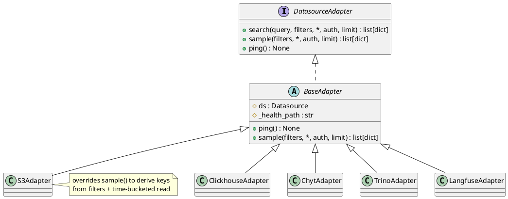

# Feature Specification: Datasource Adapter Redesign

**Feature Branch**: `001-datasource-adapter-redesign`

**Created**: 2026-05-29

**Status**: Draft

**Input**: User description: "Redesign the DatasourceAdapter protocol so all routes dispatch uniformly with no per-type branches. Derived from docs/implemented/features/02-multi-backend-search.md and 04-schema-discovery.md."

## Context

The current `DatasourceAdapter` protocol (`search()` + `ping()`) was meant to be the single
dispatch point for all five backends (S3/DuckDB, ClickHouse, Trino, Langfuse, CHYT). In practice
the abstraction leaks: S3 escapes `get_adapter()` in two of the three consuming routes, every
adapter repeats a 10-parameter signature it only forwards, `time_field` is honored by only two
backends, and schema discovery samples the first 5 hits rather than a representative spread. This
redesign makes the protocol rich enough that **every route dispatches purely through `get_adapter()`
with zero per-type branches**, while removing the mechanical forwarding boilerplate.

This is a refactor of internal structure plus two externally visible behavior changes (the schema
sample endpoint drops its S3-only `keys[]` parameter; proxy search over S3 now performs content
search instead of object listing). The "users" of this feature are the API consumers (the sampling
UI, the search UI) and the developers who add new backends.

## User Scenarios & Testing *(mandatory)*

### User Story 1 - Uniform dispatch with no per-type branches (Priority: P1)

A developer adds a new datasource backend. They subclass the adapter base, implement the search
behavior and a health path, and register one registry entry. No route file changes, and no route
contains an `if ds.type == ...` branch.

**Why this priority**: This is the core promise of the adapter pattern and the central goal of the
redesign. Closing the S3 leaks is what makes every other simplification possible.

**Independent Test**: Grep the three consuming routes (`search`, `sample`, `proxy`) for `ds.type ==`
or backend-specific imports — there should be none. Add a trivial fake backend to the registry and
confirm all three endpoints route to it without route edits.

**Acceptance Scenarios**:

1. **Given** an S3 datasource, **When** the schema-discovery endpoint is called, **Then** the request is served via the adapter's `sample()` method with no `keys[]` parameter and no S3 branch in the route.
2. **Given** an S3 connection used through the proxy endpoint, **When** a content search is issued, **Then** results come from the same content-search path as the authenticated route (not object listing).
3. **Given** any registered datasource type, **When** any of search / sample / ping is invoked, **Then** the route resolves the adapter once via `get_adapter()` and dispatches without inspecting `ds.type`.

---

### User Story 2 - Reduced boilerplate when adding or maintaining backends (Priority: P2)

A developer maintaining the adapters reads one place to understand the shared contract. Concrete
adapters contain only what is genuinely backend-specific (the search call and the health path), not
a repeated 10-parameter signature and an inline HTTP ping.

**Why this priority**: Lowers the cost and error rate of every future backend change, but depends on
the protocol shape settled in Story 1.

**Independent Test**: Confirm `ClickhouseAdapter` and `ChytAdapter` share a single inherited `ping()`
implementation, and that no adapter restates the full filter parameter list.

**Acceptance Scenarios**:

1. **Given** the redesigned adapter module, **When** a reviewer compares the five concrete adapters, **Then** each is reduced to backend-specific declarations with shared behavior inherited from a base.
2. **Given** two backends with an identical health check, **When** their `ping()` is exercised, **Then** both run the same inherited implementation parameterized only by a health path.

---

### User Story 3 - Consistent filter and time-field behavior across backends (Priority: P2)

An API consumer applies the same filter set (time range, session, trace id, trace type, input hash)
and an explicit `time_field` to any backend and gets consistent semantics. The time field is
honored by every backend, not silently ignored.

**Why this priority**: Removes a class of confusing, backend-dependent behavior, but is independent
of the structural cleanup and can ship separately.

**Independent Test**: Issue the same filtered search with an explicit `time_field` against each
backend and confirm each applies it (or applies its documented default column when omitted).

**Acceptance Scenarios**:

1. **Given** a request with an explicit `time_field`, **When** searching any backend, **Then** that field is used for the time-range filter.
2. **Given** a request with no `time_field`, **When** searching a backend, **Then** the backend's documented default timestamp column is used.
3. **Given** the same filter set, **When** applied across two different backends, **Then** the filter parameters are interpreted identically (subject to each backend's data availability).

---

### User Story 4 - Representative schema discovery (Priority: P3)

A consumer of the schema-discovery endpoint sees fields that occur throughout the filtered dataset,
not only those present in the first few records, because the sample is spread across the filter's
time range.

**Why this priority**: Improves schema-discovery quality, but the endpoint remains functional with
the existing first-N behavior, so this is the lowest-risk slice to defer.

**Independent Test**: Run schema discovery over a dataset whose later records contain fields absent
from the earliest records and confirm those later fields appear in the returned field map.

**Acceptance Scenarios**:

1. **Given** a filtered range spanning records with differing fields, **When** schema discovery runs, **Then** the returned field set reflects records drawn from across the range, not just the earliest.
2. **Given** a dataset smaller than the sample size, **When** schema discovery runs, **Then** all available records are used and no error occurs.

### Edge Cases

- **Empty result set**: search / sample over a filter matching nothing returns an empty result list (and an empty field map for schema discovery), not an error.
- **Unknown datasource type**: routes return a 400 with a clear message (current behavior preserved).
- **Proxy S3 content search over user credentials**: a content scan now runs with caller-supplied credentials against an allowlisted host; failures surface as a 502 rather than a partial listing.
- **`time_field` naming a non-existent column**: the backend surfaces a clear error rather than silently returning unfiltered results.
- **Time-bucketed sampling on a single-bucket range**: degrades gracefully to a straight sample of available records.
- **Backend ping timeout**: health checks continue to apply a short timeout and report unhealthy rather than hanging.

## Requirements *(mandatory)*

### Functional Requirements

- **FR-001**: All three consuming routes (full-text search, schema discovery, proxy search/ping) MUST dispatch to backends exclusively via `get_adapter()`, with no `ds.type` branching or backend-specific imports in route code.
- **FR-002**: The adapter protocol MUST expose `search()`, `sample()`, and `ping()` as the complete set of backend capabilities consumed by routes.
- **FR-003**: Filter parameters (`start`, `end`, `session_id`, `trace_id`, `trace_type`, `input_hash`, `time_field`) MUST be carried by a single value object built once per request, including timezone normalization, so they are not restated across routes, adapters, and backend functions.
- **FR-004**: The schema-discovery endpoint MUST NOT require a backend-specific `keys[]` parameter; S3 schema discovery MUST derive its key set from the same filters used by S3 search.
- **FR-005**: Proxy search over an S3 connection MUST perform content search via the same path as the authenticated route, not object listing.
- **FR-006**: A shared adapter base MUST provide the default `ping()` (parameterized by a per-backend health path) and a default `sample()` implementation, so concrete adapters declare only backend-specific behavior.
- **FR-007**: Backends with identical health checks MUST share a single inherited `ping()` implementation rather than duplicating it.
- **FR-008**: Every backend MUST honor an explicit `time_field` for time-range filtering, and MUST apply a documented default timestamp column when `time_field` is omitted.
- **FR-009**: Schema discovery MUST draw its sample spread across the filtered time range (time-bucketed) rather than taking the first N records, while preserving the existing field-flattening output shape (`field → {type, example}`, nested dot-keys to depth 3, `_`-prefixed fields excluded).
- **FR-010**: Existing externally visible contracts MUST be preserved except for the two intended changes: schema discovery drops `keys[]`, and proxy S3 returns content-search results. Response envelopes (`{"results": [...], "backend": ...}` and `{"fields": {...}, "sample_count": N}`) MUST remain unchanged in shape.
- **FR-011**: Unknown or unsupported datasource types MUST continue to return a 400 with a descriptive message from every consuming route.
- **FR-012**: Adding a new backend MUST require changes only to the adapter module (a new subclass plus one registry entry) and the backend's own search implementation — never to route code.

### Key Entities *(include if feature involves data)*

- **SearchFilters**: The bundled, request-scoped filter context shared by search and sample. Carries the time range, identity filters (session/trace/input-hash), trace type, and the chosen time field. Built once per request with timezones normalized to UTC.
- **DatasourceAdapter**: The protocol every backend satisfies, exposing `search()`, `sample()`, and `ping()`.
- **BaseAdapter**: Shared implementation holding the datasource, a health path, and default `ping()` / `sample()` behavior that concrete adapters inherit.
- **Field map (schema-discovery output)**: A flat map of dot-joined field path → `{type, example}`, unchanged from the current schema-discovery contract.

### Data Model *(mandatory — see [Constitution §I](../../.specify/memory/constitution.md#i-model-first-design))*

```python
from dataclasses import dataclass
from datetime import datetime


@dataclass(frozen=True)
class SearchFilters:
    """Request-scoped filter context shared by search() and sample().

    Built once per request by a FastAPI dependency that also normalizes
    naive datetimes to UTC. Replaces the repeated 7-parameter filter list
    on every route, adapter, and backend function.
    """
    start: datetime | None = None
    end: datetime | None = None
    session_id: str | None = None
    trace_id: str | None = None
    trace_type: str | None = None
    input_hash: str | None = None
    time_field: str | None = None  # backend applies its default column when None
```



### API Contract *(mandatory for HTTP changes — see [Constitution §II](../../.specify/memory/constitution.md#ii-api-first-openapi-blueprint))*

No new endpoints. Two existing endpoints change behavior; response envelopes are unchanged.

```
GET /api/public/datasource/sample
  Change:   removes the `keys[]` query parameter (S3 no longer needs it).
  Params:   datasource, start, end, session_id, trace_id, trace_type, input_hash
  Response: { "fields": { "<dot.path>": { "type": str, "example": Any }, ... },
              "sample_count": int }   # shape unchanged
  Behavior: sample is drawn time-bucketed across the filtered range.

POST /api/public/proxy/search
  Change:   S3 connections now return content-search results (was object listing).
  Response: { "results": [...], "backend": "s3" }   # shape unchanged

GET  /api/public/logs/search          # unchanged externally
POST /api/public/proxy/ping           # unchanged externally
```

## Success Criteria *(mandatory)*

### Measurable Outcomes

- **SC-001**: Zero `ds.type ==` branches or backend-specific imports remain in the three consuming route files (search, sample, proxy).
- **SC-002**: Adding a new backend touches only the adapter module and its own backend search code — no route file is modified (verified by implementing a throwaway backend).
- **SC-003**: The adapter module shrinks measurably (target: roughly halved from its current ~187 lines) with no loss of capability.
- **SC-004**: All five backends honor an explicit `time_field`; none silently ignore it (verified per backend).
- **SC-005**: Schema discovery surfaces fields present only in later records of a filtered range that the previous first-N approach missed (demonstrated on a representative dataset).
- **SC-006**: All existing endpoint response shapes are byte-compatible except the two documented changes; existing API consumers require no changes beyond dropping the now-unused `keys[]` parameter for S3 schema discovery.

## Assumptions

- The redesign preserves existing authentication and tenant-scoping behavior; the synthetic proxy auth context continues to apply on the proxy path.
- Running DuckDB content search with caller-supplied credentials on the proxy S3 path is acceptable, since the connection URL is already validated against the allowlist.
- Time-bucketed sampling may use a small fixed number of buckets across the filtered range; exact bucket count is an implementation detail tuned for representativeness vs. cost.
- Each backend has a well-defined default timestamp column to use when `time_field` is omitted.
- The field-flattening output of schema discovery (types, examples, depth-3 nesting, `_`-prefix exclusion) is correct as-is and is preserved unchanged.
- No changes to the import/sampling pipeline (`sampling.py` strategies) are in scope beyond what schema discovery requires.
